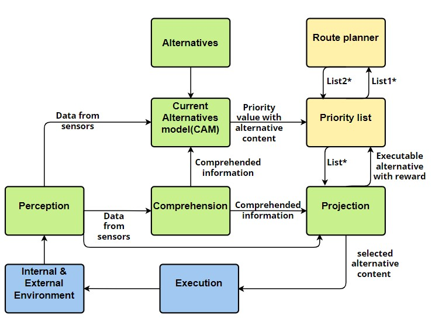

# Cognitive behavior for robots
This project proposes a scalable cognitive architecture consisting of two main components: situational awareness and decision-making. Robots implemented using our cognitive architecture need to be able to perceive their surroundings, understand the current
situation, and make decisions to achieve their goals. A scenario of an autonomous mobile robot (AMR) designed to pick up garbage on a highway is customized as the base
environment for developing and testing our cognitive architecture. The entire project will be developed and simulated in software platforms ROS(Robot Operating System )
and Gazebo.  

